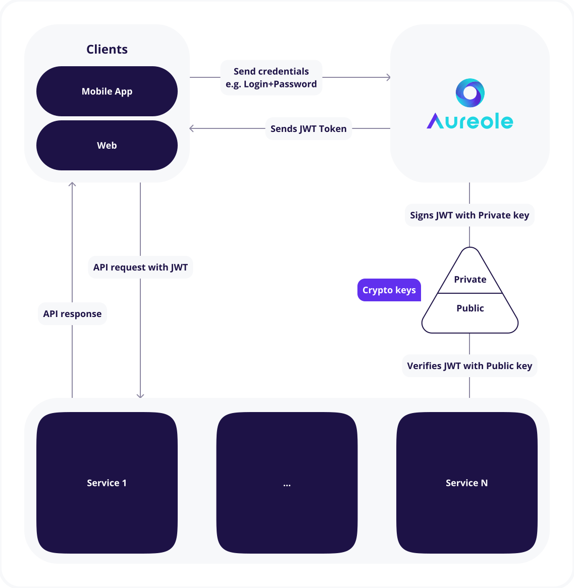

 

The most flexible modern open source authentication server.

# 🔥 Aureole

**Aureole** is an open-source server for authentication and user management. You can easily integrate it into any project. Aureole has module architecture and a rich built-in set of plugins.

# 📍Status

- [x] Pre-Alpha: Development and testing of core and built-in plugins.
- [ ] Alpha: Fixing bugs and test coverage
- [ ] Beta: Testing the product with a closed set of customers
- [ ] Release candidate: Open testing

Watch branch **main** of this repo to get notified when we are ready for public testing.

# ⚡Features

- Flexible architecture supported by plugins
- Rich set of authentication plugins
- Works with JWT
- Can be customized for your business cases (has examples of integrations with Hasura and Django)
- Language-agnostic
- Has set of plugins for hashing and cryptographic signing

Table of Contents
=================

* [Quick start: ](#-quick-start-)
   * [One-click deployment:](#one-click-deployment)
* [Architecture](#-architecture)
* [Plugins](#️-plugins)
   * [Authentication](#authentication)
   * [2-Factor Authentication](#2-factor-authentication)
   * [Authorization](#authorization)
   * [Identity manager](#identity-manager)
   * [Storage](#storage)
   * [Key storage](#key-storage)
   * [Password hashing](#password-hashing)
   * [Signing keys](#signing-keys)
   * [Sender](#sender)
   * [Administrative](#administrative)
* [Business cases](#business-cases)
* [Support and fixing bugs](#-support-and-fixing-bugs)
* [Stargazers](#-stargazers)
* [Forkers](#️-forkers)
* [License](#-license)
* [Translations](#️-translations)

# 📖 Table of contents 

- [Quick start:](#-quick-start)
    - [One-click deployment](#one-click-deployment)
- [Architecture](#architecture)
- [Plugins](#plugins)
    - [About plugins](#about-plugins)
    - [Authentication](#authentication)
    - [2-Factor Authentication](#2-factor-authentication)
    - [Authorization](#authorization)
    - [Identity manager](#identity-manager)
    - [Storage](#storage)
    - [Key storage](#key-storage)
    - [Password hashing](#password-hashing)
    - [Signing keys](#signing-keys)
    - [Sender](#sender)
    - [Administrative](#administrative)
- [Business cases](#business-cases)
- [Support and fixing bugs](#-support-and-fixing-bugs)
- [Stargazers](#-stargazers)
- [Forkers](#️-forkers)
- [License](#license)
- [Translations](#%EF%B8%8F-translations)

# 🚀 Quick start: 

## One-click deployment:

| Privider | Link | Documentation |
| --- | --- | --- |
| Heroku |  | Link |
| Render |  | Link |

# ⚙ Architecture

Aureole is a server-side service. It receives authentication requests from clients and issues JWTs with a private key. Then your backend verifies JWT with the public key derived from the private one.
Aureole can also work with a custom Identity Manager.

 

# 🖇️ Plugins

We made many plugins for basic needs. But feel free to contribute to our project by creating any new one.

There are multiple types of plugins:

## Authentication

- [x] Login-Password
- [x] Passwordless by E-mail
- [x] Passwordless by SMS
- [x] Google OAuth 2.0
- [x] Facebook OAuth 2.0
- [x] VK OAuth 2.0
- [x] Apple ID
- [ ] GitHub
- [ ] Instagram
- [ ] Challenge-response authentication

## 2-Factor Authentication

- [x] SMS
- [x] Google Authenticator
- [ ] YubiKey

## Authorization

- [x] JWT

## Identity manager

- [x] Standard
- [x] Webhook

## Storage

- [x] Etcd
- [x] InMemory
- [x] Redis

## Key storage

- [x] File
- [x] Url
- [x] HashiCorp Vault

## Password hashing

- [x] Argon2
- [x] Pbkdf2 (Django)

## Signing keys

- [x] JWK
- [x] Pem

## Sender

- [x] E-mail (SMTP)
- [x] Twillio

## Administrative

- [x] List of all URLs

# 👾Business cases

- Registration and authentication of users on a website
- Advanced replacement of default authentication in Django
- Authentication server for Hasura
- Single auth server for multiple domains
- Authentication in Kubernetes with OpenID
- Authentication in Docker Registry
- Authentication for embedded devices

# 💬 Support and fixing bugs

If you have an issue and want to contact us feel free to use any channel:

- Issues and bug tracking: [GitHub issues](https://github.com/Art9Studio/Aureole/issues)
- Support and feedback: [Discord](https://discord.gg/EjBQ3fKg)
- Text us: [Telegram](https://t.me/joinchat/lsaDf65QlHk5M2Ri)
- Follow us on Twitter: [@aureolecloud](https://twitter.com/aureolecloud)
- Write an E-mail: [hi@aureole.cloud](mailto:hi@aureole.cloud)

# ⭐ Stargazers

# 🛠️ Forkers

# 📝 License 

The core Aureole is available under the [GNU Affero General Public
License v3](https://www.gnu.org/licenses/agpl-3.0.en.html) (AGPL-3.0).

**Commercial licenses** are available on request, if you do not wish to use the Aureole under the AGPL license. Typically, they come bundled with support plans and SLAs. Please feel free to contact us at [hi@aureole.cloud](mailto:hi@aureole.cloud).

All **other contents** (except those in [`internal`](internal) and
[`plugins`](plugins) directories) are available under the [MIT License](LICENSE-community).
This includes everything in all other directories.

# 🈂️ Translations

- [English 🇬🇧](https://github.com/Art9Studio/Aureole)
- [Russian 🇷🇺](https://github.com/Art9Studio/Aureole)
